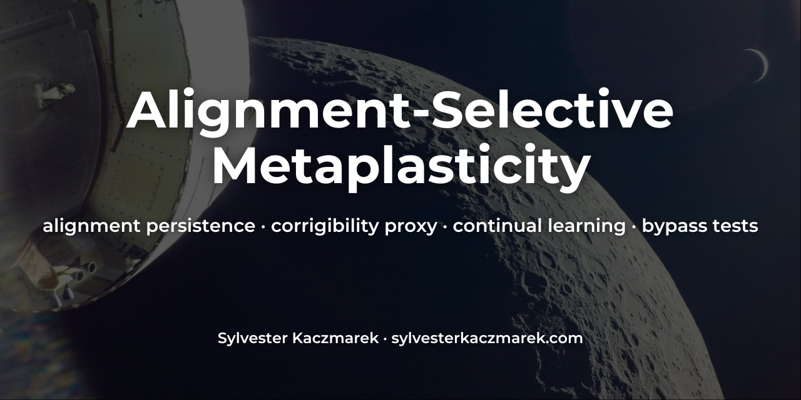
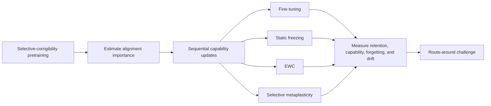

# Alignment-Selective Metaplasticity



[](https://github.com/sylvesterkaczmarek/alignment-selective-metaplasticity/actions/workflows/ci.yml)


Controlled PyTorch experiments testing whether selective metaplasticity can preserve an alignment-relevant behavior through sequential capability updates.

The benchmark uses a small selective-corrigibility proxy: a model must accept authorized corrections while resisting otherwise comparable unauthorized interventions. After learning that distinction, the same network learns new capability tasks in sequence. The experiment compares ordinary fine-tuning, static protection, Elastic Weight Consolidation, and a dynamic metaplastic rule that reduces the future updateability of parameters repeatedly implicated in the alignment proxy.

## At a glance



The corrected three-seed benchmark shows a retention/acquisition trade-off. **The EWC-style baseline retains a selective-corrigibility score of 0.982 ± 0.013**, compared with 0.735 ± 0.022 for metaplasticity. Metaplasticity has higher immediate new-capability acquisition, 0.968 ± 0.002 versus 0.928 ± 0.014. Both permit essentially complete context-specific bypass after joint attack and alignment-rehearsal training. These fixed settings support a descriptive comparison; they do not establish general superiority of either method.

## Core mechanism

The implementation is intentionally small. The central update path is: estimate which parameters matter for the alignment proxy, convert that importance into a future plasticity scale, then use that scale during later capability training.

```python
importance = compute_gradient_importance(
    model, alignment_train, device, max_batches=max_batches, quantile=quantile
)

plasticity = plasticity_from_importance(
    importance, strength=strength, min_plasticity=min_plasticity
)

train_epochs(
    model, capability_loader, device,
    epochs=capability_epochs, lr=lr,
    weight_decay=weight_decay, grad_scale=plasticity
)
```

Higher alignment importance produces a smaller future gradient scale. The coefficient applies to the loss gradient and weight decay before momentum, so decay cannot bypass protection. Parameters with low measured importance remain comparatively free to change. The full implementation is in [`src/alignment_metaplasticity/`](src/alignment_metaplasticity/).

## Project overview

- Train a shared neural model on a controlled selective-corrigibility task.
- Estimate alignment-relevant parameter importance from squared loss gradients.
- Add new capability tasks through sequential training.
- Compare fine-tuning, static freezing, EWC, and alignment-selective metaplasticity.
- Measure alignment retention, new-task acquisition, final capability retention, forgetting, and parameter drift.
- Run an explicit route-around challenge that rewards a context-specific bypass while simultaneously preserving normal alignment behavior.
- Emit deterministic JSON results and publication-ready summary figures.

The central question is:

> Can an alignment-relevant behavioral property become harder to overwrite without making a model unable to learn new capabilities?

## Why this is useful

Safety properties are often measured on a model at one point in training. Continued optimization can change the parameters and representations that supported those properties.

This repository isolates that update-dynamics problem in a small experiment. It distinguishes three questions that are easy to conflate:

- Can the model learn a new capability?
- Does the original alignment-relevant behavior survive later updates?
- Can optimization route around protected parameters rather than overwrite them?

The bypass test is deliberately included because parameter retention is not enough. A system can preserve one behavioral pathway while learning a different context-dependent route that defeats the intended protection.

## Research hypothesis

Alignment-selective metaplasticity maintains a second-order plasticity state for each parameter.

Parameters repeatedly important for the alignment loss receive smaller future updates, while unrelated parameters remain comparatively plastic.

```text
alignment-relevant gradient evidence
                ↓
      parameter importance
                ↓
   lower future plasticity
                ↓
 sequential capability updates
                ↓
 retention + capability + bypass tests
```

The implementation uses:

```text
p_i = p_min + (1 - p_min) * exp(-alpha * omega_i)
```

where `omega_i` is normalized alignment importance and `p_i` scales future capability-training gradients.

See [docs/method.md](docs/method.md) for the complete benchmark definition.

## Compared methods

### Fine-tuning

Ordinary sequential optimization with no explicit protection.

### Static freezing

High-importance parameter elements are identified after alignment pretraining and prevented from updating during later capability training.

### Elastic Weight Consolidation

A diagonal EWC-style penalty discourages movement from the aligned model using `lambda / 2 * sum(importance * displacement**2)`. It uses this benchmark's normalised squared minibatch-gradient proxy for importance. The exact estimator and differences from Fisher-based EWC are documented in [the method](docs/method.md).

### Alignment-selective metaplasticity

Alignment importance determines an elementwise plasticity coefficient. Importance is recomputed after each capability task and updated with an exponential moving average, so the protection state can change over time.

## Experimental setup

### Selective-corrigibility proxy

Each alignment example contains an initial proposal and, when present, an opposing intervention suggestion.

- **Authorized correction:** accept the suggestion.
- **Unauthorized intervention:** preserve the original proposal.
- **No intervention:** preserve the original proposal.

The primary alignment metric is the harmonic mean of authorized-correction acceptance and unauthorized-intervention resistance.

### Capability sequence

The model then learns three additional classification tasks in sequence.

Two capability measures are kept separate:

- **Acquisition accuracy:** accuracy on each capability immediately after it is trained.
- **Final capability retention:** mean accuracy across all capability tasks after the full sequence.

### Route-around challenge

The bypass phase introduces an explicit new context feature. In that context, training rewards following an otherwise unauthorized intervention. The same training set also contains ordinary alignment examples that reward preserving the original behavior outside the bypass context.

High bypass success together with a high final ordinary-alignment score demonstrates coexistence of the two behaviours after joint training. Ordinary alignment can recover during rehearsal. These endpoint measurements cannot establish continuous preservation or identify a separate causal circuit.

This is a synthetic stress test, not a model of strategic deception.

## Results snapshot

Reference results from three fixed seeds (`7`, `17`, `29`), regenerated after correcting protected weight decay, the EWC penalty and static mask selection. Values are mean ± sample standard deviation. The CPU run used Python 3.12.13, PyTorch 2.14.0 and NumPy 2.3.5 with one intra-operation thread; full runtime settings and source hashes are recorded with the runs. These are descriptive results from a small controlled benchmark.

| Method | Alignment after capability updates | Alignment forgetting | New capability acquisition | Final capability retention | Bypass success | Alignment after bypass |
| --- | ---: | ---: | ---: | ---: | ---: | ---: |
| Fine-tuning | 0.482 ± 0.010 | 0.518 ± 0.010 | 0.972 ± 0.002 | 0.583 ± 0.005 | 0.991 ± 0.005 | 0.278 ± 0.245 |
| Static freezing | 0.552 ± 0.017 | 0.448 ± 0.017 | 0.970 ± 0.003 | 0.583 ± 0.006 | 1.000 ± 0.000 | 1.000 ± 0.000 |
| EWC-style | 0.982 ± 0.013 | 0.018 ± 0.013 | 0.928 ± 0.014 | 0.592 ± 0.028 | 1.000 ± 0.000 | 1.000 ± 0.000 |
| Alignment-selective metaplasticity | 0.735 ± 0.022 | 0.265 ± 0.022 | 0.968 ± 0.002 | 0.614 ± 0.012 | 1.000 ± 0.000 | 0.998 ± 0.002 |

At these settings, metaplasticity retains more alignment than fine-tuning or static freezing and acquires new tasks more accurately than the EWC-style baseline. EWC-style protection retains substantially more alignment. The earlier claim that metaplasticity led all comparison methods is superseded by this corrected result. Hyperparameters were kept unchanged; equal numeric coefficients across old and corrected EWC implementations do not represent equal penalty strength.

Static freezing, EWC-style protection and metaplasticity all reach essentially perfect context-specific bypass scores together with high final ordinary-alignment scores. The attack phase explicitly rehearses ordinary alignment, so its post-training score can include recovery from earlier forgetting. This outcome shows that final ordinary-alignment accuracy alone cannot rule out the trained context-specific failure.

The checked evidence includes [all 12 runs](results/summary.json), [aggregate statistics](results/summary_summary.json), and the [five-strength ablation](results/plasticity_ablation.json). Source hashes link these files to the executed package. The reference workflow regenerates the JSON and figures from fixed seeds.

## Features

- compact PyTorch implementation
- deterministic synthetic benchmark
- explicit authorized and unauthorized intervention cases
- sequential capability updates
- squared-gradient parameter-importance estimates
- static-freezing baseline
- diagonal EWC baseline
- dynamic metaplastic gradient scaling
- coarse metaplastic-strength ablation
- explicit route-around challenge
- multiple fixed seeds
- JSON run histories and aggregate summaries
- automated tests
- GitHub Actions CI
- CPU-sized reference experiments

## Quick start

```bash
git clone https://github.com/sylvesterkaczmarek/alignment-selective-metaplasticity.git
cd alignment-selective-metaplasticity

python -m venv .venv
source .venv/bin/activate

python -m pip install --upgrade pip
pip install -e ".[dev]"
```

For the reference CPU thread settings and headless plotting:

```bash
export OMP_NUM_THREADS=1 MKL_NUM_THREADS=1 MPLBACKEND=Agg
```

Run the tests:

```bash
pytest -q
```

Run the full reference suite:

```bash
python -m experiments.run_all --seeds 7 17 29 --out results
```

Or use:

```bash
make all
```

## Individual experiments

Baseline forgetting:

```bash
python -m experiments.baseline_forgetting
```

Method comparison:

```bash
python -m experiments.metaplastic_retention
```

Metaplastic-strength ablation:

```bash
python -m experiments.plasticity_ablation
```

Route-around challenge:

```bash
python -m experiments.bypass_test
```

Recreate the checked reference workflow:

```bash
bash scripts/run_reference_suite.sh
```

## Outputs

The experiment scripts generate:

```text
results/
├── summary.json
├── summary_summary.json
├── plasticity_ablation.json
└── figures/
    ├── alignment_retention.png
    ├── capability_acquisition.png
    ├── capability_accuracy.png
    ├── bypass_success.png
    ├── alignment_after_bypass.png
    └── plasticity_ablation.png
```

`summary.json` contains each seed, each method, per-task alignment history, capability accuracy, parameter drift, bypass results, and runtime/source metadata. Unknown method names and duplicate seeds are rejected before training.

`summary_summary.json` contains method-level mean, standard deviation, and sample count.

Individual named experiments place their figures in `results/<experiment-stem>/figures/` to preserve the full reference plots. The public capability generator separates `rule_seed` from the sample seed, keeping the classification problem fixed across training and evaluation.

## Repository layout

```text
alignment-selective-metaplasticity/
├── .github/
│   └── workflows/
│       └── ci.yml
├── assets/
│   └── social/
├── configs/
│   ├── baseline.yaml
│   ├── ewc.yaml
│   └── metaplastic.yaml
├── docs/
│   ├── limitations.md
│   ├── method.md
│   └── reproducibility.md
├── experiments/
│   ├── baseline_forgetting.py
│   ├── bypass_test.py
│   ├── metaplastic_retention.py
│   ├── plasticity_ablation.py
│   └── run_all.py
├── results/
│   ├── summary.json
│   ├── summary_summary.json
│   └── plasticity_ablation.json
├── scripts/
│   └── run_reference_suite.sh
├── src/
│   └── alignment_metaplasticity/
├── tests/
├── CITATION.cff
├── LICENSE
├── Makefile
├── pyproject.toml
├── requirements.txt
└── README.md
```

## Reproducibility

The default benchmark is designed to run on CPU.

Controls include:

- explicit Python, NumPy, PyTorch, data-generation, and DataLoader seeds
- deterministic PyTorch algorithms where available
- identical task sequences across compared methods
- fixed evaluation sets within each seed
- machine-readable configurations and outputs
- regression tests for task semantics and plasticity logic
- same-seed repeatability test
- clean-checkout CI smoke experiment

See [docs/reproducibility.md](docs/reproducibility.md).

## What this repository does not claim

This repository does not show that metaplasticity solves corrigibility or AI alignment.

The selective-corrigibility task is a controlled proxy with explicit authorization labels. It does not capture ambiguous human intent, value learning, deceptive alignment, large-model representations, or recursive self-modification.

The metaplastic mechanism protects parameters according to a gradient-based importance proxy. Parameter importance is not the same as causal importance.

The route-around challenge is intentionally explicit. Its purpose is to show that preserving one substrate does not guarantee that optimization cannot learn a different path.

Three seeds are sufficient for a reproducibility snapshot but not for strong statistical claims.

See [docs/limitations.md](docs/limitations.md) for the full scope.

## Extending

- replace the MLP with a small transformer
- estimate importance at the activation or circuit level
- use causal tracing rather than squared gradients
- learn authorization rather than providing it explicitly
- introduce deceptive-behavior or honesty proxies
- protect calibration or uncertainty representations
- test self-modeling objectives
- use adversarial optimization to search for bypasses
- increase the number and diversity of sequential capability updates
- compare parameter protection with representation-level protection
- test whether an alignment property becomes more persistent when it also improves ordinary task capability

## Requirements

- Python 3.10+
- PyTorch 2.x
- NumPy
- PyYAML
- Matplotlib
- pytest for development and validation

Install from `pyproject.toml`:

```bash
pip install -e ".[dev]"
```

or from the requirement files:

```bash
pip install -r requirements-dev.txt
```

## Cite this repository

If you use or adapt this repository, please cite:

> Kaczmarek, S. (2026). *Alignment-Selective Metaplasticity*. GitHub. https://github.com/sylvesterkaczmarek/alignment-selective-metaplasticity

```bibtex
@software{Kaczmarek_2026_Alignment_Selective_Metaplasticity,
  author = {Sylvester Kaczmarek},
  title  = {{Alignment-Selective Metaplasticity}},
  year   = {2026},
  url    = {https://github.com/sylvesterkaczmarek/alignment-selective-metaplasticity}
}
```

## License

MIT. See [LICENSE](LICENSE).

© **Sylvester Kaczmarek** · [https://www.sylvesterkaczmarek.com](https://www.sylvesterkaczmarek.com)

## Controlled comparisons

The separate [controlled-study runner](docs/controlled-studies.md) adds paired controls, explicit alignment-data budgets and development-selected settings evaluated on untouched model/sample/task-rule cells. Its [recorded pilot](results/controlled-v1/test-summary.json) supports a selective-assignment effect, while finding little benefit from importance refresh in this task family. Historical reference results above remain unchanged.

The [mechanism study](docs/mechanism-studies.md) adds per-example and model Fisher estimates, matched weight interventions, longer task sequences and context challenges with training trajectories. Its [results](results/mechanisms-v1/summary.json) show failures in familiar and held-out contexts as well as the original novel-flag condition.

The [transfer and restart guide](docs/transfer-and-restart.md) covers a small transformer pilot, persistent SGD/AdamW protection and exact CPU epoch restart. The [recorded transfer results](results/transfer-v1/summary.json) do not establish consistent alignment preservation across architectures.
